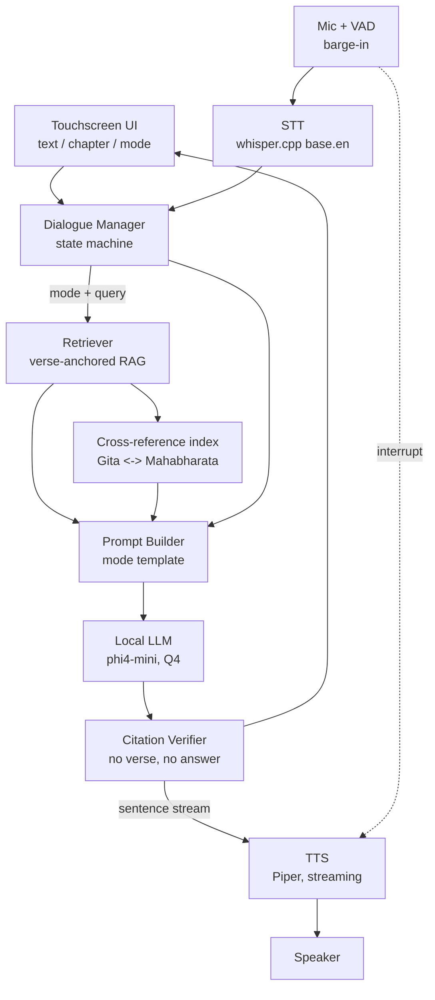

# Shastra Samvad — Architecture Diagram

One spoken turn, start to finish. Everything below runs on-device — no
network call anywhere in the pipeline. Target hardware: Jetson Nano 4GB.

> This diagram renders natively on GitHub. If your viewer doesn't render
> Mermaid, open [`docs/architecture.html`](docs/architecture.html) instead
> (download it and open in a browser — GitHub serves raw HTML as plain text,
> it won't render inline on github.com).

## Stages

| Stage | Does | Runs as |
|---|---|---|
| STT | Speech to text, English only | faster-whisper (dev) / whisper.cpp (device) |
| Dialogue Manager | Classifies the turn — Teach / Doubt / Debate / Counsel — tracks lesson state | rule phrases + embedding similarity |
| Retriever | Top-k verses for the query, strategy varies per mode | bge-small-en-v1.5 + FAISS |
| Cross-reference | Links a Gita verse to its illustrating Mahabharata passage | precomputed cosine map, ≥0.80 |
| Prompt Builder | Assembles persona + mode instruction + verses + history | template per mode |
| LLM | Generates the answer, streaming | phi4-mini, Q4_K_M GGUF, llama.cpp |
| Citation Verifier | Withholds any sentence not grounded in a retrieved verse | cosine gate + NLI contradiction check |
| TTS | Speaks each verified sentence as it clears | Piper, streaming |

## Hardware (Jetson Nano build)

- Jetson Nano 4GB — college-provided
- 5" capacitive touchscreen
- ReSpeaker 2-Mic HAT
- MAX98357A amp + speaker
- 20,000 mAh USB-C PD bank
- Heatsink + fan

Full detail: [`software_architecture.md`](software_architecture.md) ·
[`README.md`](README.md) · [`backend/config.py`](backend/config.py)
