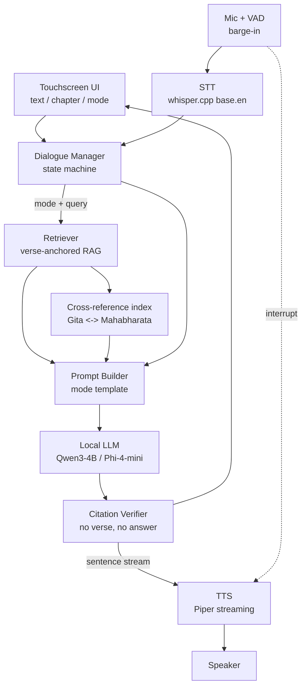

# Shastra Samvad — Software Architecture
*Team reference document · Offline Conversational Guru-Shishya Device*

---

## 1. Purpose

This document describes the **software** system of Shastra Samvad — the fully offline pipeline that turns a spoken question into a scripture-grounded spoken answer, running entirely on the device with no internet. It is the shared reference for everyone building the software.

---

## 2. Design principles

1. **Offline-first.** Every model (STT, embeddings, LLM, TTS) runs locally. No API calls, ever.
2. **Grounded, not generative-from-thin-air.** Answers must be traceable to specific verses. "No verse, no answer."
3. **Low perceived latency.** Stream output to speech sentence-by-sentence; the user hears the first words in ~4–6 s.
4. **Mode-aware.** The same engine behaves as teacher, doubt-solver, debater, or counsellor depending on detected intent.
5. **Modular.** Each stage is a replaceable component with a clean interface, so we can swap a model without touching the rest.

---

## 3. High-level pipeline

---

## 4. Components

### 4.1 Speech-to-Text (STT)
- **Engine:** `whisper.cpp`, model `base.en` (English only → smaller and more accurate than multilingual).
- **Input:** 16 kHz mono audio from the mic.
- **VAD:** Silero or WebRTC VAD for endpointing (knowing when the user stopped) and **barge-in** (detecting the user talking over the Guru).
- **Output:** transcript string + timestamps.
- **Latency budget:** 1–3 s for a short utterance.

### 4.2 Dialogue Manager (state machine)
The controller that decides *what kind of turn* this is and routes accordingly.

- **Intent classifier:** lightweight classifier (rules + small model / embedding similarity) that labels each turn as one of:
  - `TEACH` — user wants structured teaching of a chapter.
  - `DOUBT` — user raises a doubt/clarification mid-lesson.
  - `DEBATE` — user challenges or argues a position (Shastrarth).
  - `COUNSEL` — user asks a general/life/ethical question.
- **State it tracks:** current text, current chapter, lesson position (which verse/section we're on), debate stance, recent turn history.
- **Output:** `(mode, query, context_state)` → drives retrieval strategy and prompt template.

### 4.3 Retriever (RAG)
- **Corpus:** Bhagavad Gita (Telang) + Mahabharata (Ganguli), pre-chunked with **verse-level anchors** (`Gita 2.47`, `Mahabharata: Udyoga Parva §33`).
- **Embeddings:** `bge-small-en-v1.5` or `all-MiniLM-L6-v2`.
- **Index:** FAISS (flat for exactness at this scale; IVF if needed). Prebuilt and shipped on device.
- **Retrieval strategy varies by mode:**
  - `TEACH` → sequential retrieval within the selected chapter.
  - `DOUBT` → focused semantic retrieval around the doubt + current lesson context.
  - `DEBATE` → retrieve verses supporting *and* countering the user's position.
  - `COUNSEL` → broad semantic retrieval mapping the situation to principles.

### 4.4 Cross-reference index (Gita ↔ Mahabharata)
- Precomputed map linking each Gita teaching to Mahabharata episodes that illustrate it, and vice-versa.
- Lets the Guru explain a Gita principle and cite the matching Mahabharata narrative as illustration.
- Built once offline (semantic clustering + manual curation of the strongest links).

### 4.5 Prompt Builder
- Assembles the final prompt from: system persona (the Guru), the active **mode template**, the retrieved verses (with their anchors), and conversation history.
- Mode templates differ in instruction, tone, and how verses are used (teach vs. argue vs. counsel).

### 4.6 Local LLM
- **Primary:** `Qwen3-4B` (toggleable reasoning mode — good for Shastrarth) or `Phi-4-mini` (strongest tiny reasoner). `Gemma 3 4B` as alternative.
- **Runtime:** `llama.cpp` (Q4 quant) on CPU on Jetson Nano; CUDA offload via LLM_GPU_LAYERS for acceleration.
- **Constraints:** answer-length cap, must reference provided verses, concise reasoning scratchpad.

### 4.7 Citation Verifier ("no verse, no answer")
- After generation, checks that the answer's claims are supported by the retrieved verses.
- If unsupported → the Guru states it cannot find scriptural basis rather than fabricating.
- Emits the list of cited verse anchors to the UI.
- This is the core anti-hallucination guardrail **and** a patent claim.

### 4.8 Ethical / counsel guardrail
- For `COUNSEL` turns: maps the situation to scriptural principles, applies a values-alignment policy, and refuses/redirects harmful or out-of-scope requests. Fully offline.

### 4.9 Text-to-Speech (TTS)
- **Engine:** `Piper` (fast neural TTS, real-time on the board, good English voices).
- **Streaming:** synthesizes **sentence-by-sentence** as the LLM emits them → low time-to-first-audio.
- **Barge-in:** playback halts immediately when VAD detects the user speaking.

### 4.10 Orchestrator
- Async event loop tying the stages together with streaming and interrupt handling.
- Manages the barge-in path (mic → stop TTS → new STT turn).

---

## 5. Data flow (one turn)

1. User taps a chapter / mode on screen, presses talk, speaks.
2. VAD segments audio → whisper.cpp transcribes → transcript.
3. Dialogue Manager classifies mode, updates state.
4. Retriever fetches verses (strategy per mode); cross-reference adds linked passages.
5. Prompt Builder assembles the mode-specific prompt with verses.
6. LLM generates, streaming tokens.
7. Citation Verifier checks each sentence; verified sentences stream to Piper.
8. Piper speaks; UI shows transcript + verse citations.
9. If the user talks over the Guru → barge-in stops playback and starts a new turn.

---

## 6. Latency budget (target 5–10 s perceived)

| Stage | Time |
|-------|------|
| STT (short utterance) | 1–3 s |
| Retrieval + cross-ref | < 0.5 s |
| First-sentence LLM generation | ~2 s |
| First TTS chunk | ~0.5 s |
| **Time to first spoken words** | **~4–6 s** |

The rest of the answer plays continuously as it generates — the user is never waiting for the full answer.

---

## 7. Model summary

| Stage | Model | Runtime | Notes |
|-------|-------|---------|-------|
| STT | whisper.cpp `base.en` | CPU | English only |
| VAD | Silero / WebRTC | CPU | Endpointing + barge-in |
| Embeddings | bge-small-en-v1.5 / MiniLM | CPU | For RAG |
| LLM | Phi-4-mini (Q4_K_M GGUF) | llama.cpp (CPU / CUDA on Jetson Nano) | Reasoning-capable |
| TTS | Piper | CPU | Streaming |

---

## 8. Interfaces between modules (contract)

- `STT.transcribe(audio) -> {text, segments}`
- `DialogueManager.route(text, state) -> {mode, query, state}`
- `Retriever.search(query, mode, state) -> [{verse_id, text, score}]`
- `CrossRef.expand([verse_id]) -> [{verse_id, text}]`
- `PromptBuilder.build(mode, verses, history) -> prompt`
- `LLM.generate(prompt) -> token_stream`
- `CitationVerifier.check(sentence, verses) -> {ok, cited_ids}`
- `TTS.speak(sentence) -> audio_stream`

Keeping these contracts stable lets any component be swapped independently.